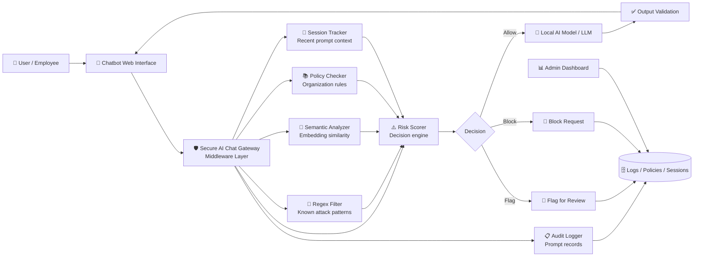
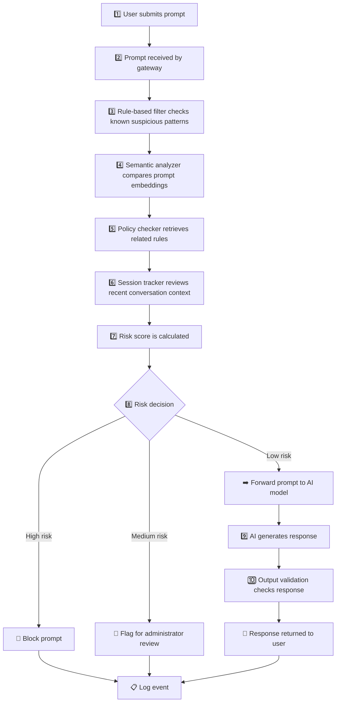
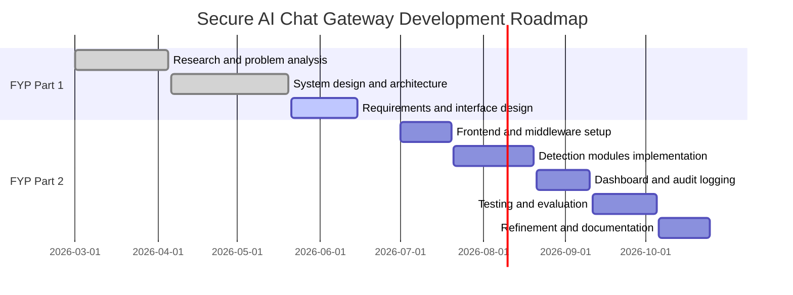

<div align="center">

# 🛡️ Secure AI Chat Gateway

### *Prompt Injection Detection & AI Governance Middleware for Organizational Chatbot Systems*


*A lightweight security gateway that sits between users and an AI chatbot to support prompt monitoring, prompt injection detection, organization-specific policy enforcement, session-aware risk scoring, and audit visibility.*

---

**Author:** Mah Wilson  
**Institution:** Universiti Teknologi Malaysia (UTM)  
**Project Type:** Final Year Project (FYP) · AI Security / LLM Governance / Cybersecurity  

</div>

---

## 🌩️ Problem Background

LLM-powered chatbots are increasingly being adopted in organizational environments for internal support, knowledge retrieval, workflow assistance, and customer-facing automation. However, these systems introduce a different kind of security challenge because users interact with them through natural language instead of fixed application inputs.

Common risks include:

- **Prompt injection** — crafted prompts attempt to override instructions or manipulate chatbot behavior.
- **Role escalation** — users may attempt to make the model act as an administrator, developer, or unrestricted assistant.
- **Semantic paraphrasing** — malicious intent may be reworded to bypass simple keyword filters.
- **Multi-turn manipulation** — suspicious intent may be built gradually across several prompts.
- **Limited organization-specific governance** — public moderation tools may not fully reflect internal policies.
- **Weak audit visibility** — organizations may struggle to trace why a prompt was allowed, blocked, or flagged.

This project explores how a lightweight middleware layer can improve visibility, explainability, and policy control for organizational AI chatbot deployments.

---

## 💡 What is Secure AI Chat Gateway?

**Secure AI Chat Gateway** is a prototype-stage middleware system designed to evaluate prompts before they reach an AI model.

Instead of relying only on built-in AI moderation, the gateway introduces a dedicated governance layer that can be customized around organizational requirements.

| Capability | Description |
|---|---|
| 🔎 Prompt Monitoring | Intercepts and evaluates user prompts before model processing |
| 🧱 Rule-Based Filtering | Detects known suspicious phrases, jailbreak patterns, and role escalation attempts |
| 🧠 Semantic Similarity Analysis | Identifies suspicious intent even when prompts are paraphrased |
| 📚 Retrieval-Assisted Policy Checking | Compares prompts against stored policies and suspicious prompt references |
| 🧵 Session-Aware Tracking | Reviews recent conversation turns for gradual manipulation attempts |
| ⚠️ Risk Scoring | Aggregates multiple security signals into an explainable score |
| ✅ Output Validation | Checks model responses before returning them to the user |
| 📋 Audit Logging | Records prompts, scores, decisions, and security flags for review |
| 📊 Admin Dashboard | Provides monitoring visibility for administrators |

Unlike a single-layer keyword filter, this project combines multiple lightweight controls into a transparent and explainable pipeline.

---

## ✨ Key Differentiators

| Area | How This Project Stands Out |
|---|---|
| Organization-aware security | Focuses on custom policies instead of only generic public moderation |
| Lightweight architecture | Designed for prototype-scale deployment without heavy enterprise infrastructure |
| Explainable decision-making | Risk scores and detection reasons are logged for traceability |
| Semantic robustness | Uses embedding-based similarity to detect paraphrased prompt injection attempts |
| Multi-turn awareness | Tracks short conversation history instead of treating each prompt in isolation |
| Governance-first design | Emphasizes monitoring, auditability, and policy enforcement alongside detection |

---

## 🏗️ System Architecture

Secure AI Chat Gateway is designed as a middleware layer between the chatbot interface and the AI model.



### Architecture Summary

The gateway does not replace the AI model. Instead, it acts as a protective and observable layer that evaluates prompts, applies policy checks, assigns risk scores, and records security-relevant events.

---

## 🔄 Prompt Processing Flow



---

## 🧠 Risk Scoring Concept

The prototype uses a layered scoring approach. Each detection module contributes to the final prompt risk score.

```python
risk_score = 0

# 1. Rule-based detection
if regex_match(prompt, suspicious_patterns):
    risk_score += 30

# 2. Semantic similarity detection
similarity_score = compare_embedding(prompt, suspicious_prompt_vectors)
if similarity_score >= SEMANTIC_THRESHOLD:
    risk_score += 35

# 3. Session-aware monitoring
if detect_multi_turn_manipulation(session_history):
    risk_score += 25

# 4. Policy retrieval checking
if violates_retrieved_policy(prompt, organization_policies):
    risk_score += 20

# 5. Decision
if risk_score >= BLOCK_THRESHOLD:
    block_prompt()
elif risk_score >= REVIEW_THRESHOLD:
    flag_for_review()
else:
    forward_to_ai_model()
```

The goal is not to create an overcomplicated black-box detector, but to demonstrate a transparent and adjustable governance approach.

---

## 🛠️ Planned Technology Stack

| Category | Technology | Role |
|---|---|---|
| Frontend | React | Chatbot interface and admin monitoring dashboard |
| Backend / Middleware | Node.js + Express.js | Prompt routing, filtering, scoring, and API handling |
| Operational Database | MongoDB | Stores prompts, logs, users, policies, and audit records |
| Vector Database | ChromaDB | Stores embeddings for suspicious prompts and policy references |
| Session Tracking | Redis | Maintains short-term conversation context |
| Local AI Model | Ollama | Runs a local LLM for prototype demonstration |
| Semantic Embeddings | Sentence Transformers | Converts prompts into embeddings for similarity analysis |
| Deployment | Docker | Supports portable prototype deployment |

---

## 📊 Planned Evaluation Metrics

The system will be evaluated using benign prompts, direct prompt injection attempts, paraphrased attacks, and multi-turn adversarial scenarios.

| Metric | Purpose |
|---|---|
| Detection Rate | Measures how many malicious prompts are correctly detected |
| False Positive Rate | Measures how often benign prompts are wrongly flagged |
| Precision | Measures reliability of flagged detections |
| Recall | Measures how many actual attacks are successfully captured |
| F1-Score | Balances precision and recall |
| Semantic Robustness | Tests detection against paraphrased malicious prompts |

---

## 📁 Repository Structure

```text
secure-ai-chat-gateway/
├── docs/
│   ├── diagrams/
│   │   ├── system-architecture.png
│   │   ├── prompt-processing-workflow.png
│   │   └── attack-surface.png
│   │
│   ├── proposal/
│   │   └── project-overview.md
│   │
│   └── research-notes/
│       └── literature-summary.md
│
├── design/
│   ├── system-architecture.md
│   ├── detection-strategy.md
│   └── evaluation-plan.md
│
├── frontend/              # Planned React chatbot interface
├── backend/               # Planned middleware API
├── data/                  # Planned prompt datasets and policy samples
├── assets/
│   └── screenshots/
│
├── README.md
├── LICENSE
└── .gitignore
```

---

## 🚧 Current Development Status

### ✅ Completed / In Progress

- Problem background and motivation
- Literature review on AI chatbot security and prompt injection
- Existing system analysis
- Proposed middleware architecture
- Technology stack comparison
- Functional and non-functional requirements
- Initial workflow and interface design
- Early architecture and dashboard visualizations

### 🔜 Upcoming Development Work

- Build React chatbot interface
- Implement Node.js / Express middleware
- Add regex-based prompt filtering rules
- Integrate semantic similarity checking
- Connect vector database for policy and prompt retrieval
- Add session-aware monitoring
- Implement risk scoring and output validation
- Build admin dashboard for logs and monitoring
- Prepare benign and adversarial prompt test cases
- Evaluate detection performance using defined metrics

---

## 🔐 Scope and Limitations

This project is designed as an academic prototype and does not claim to fully eliminate all prompt injection or LLM security risks.

The prototype mainly focuses on:

- Direct prompt injection attempts
- Role escalation prompts
- Suspicious semantic paraphrasing
- Multi-turn manipulation patterns
- Organization-specific policy monitoring
- Audit logging and administrator visibility

It does not aim to replace production-grade enterprise AI security platforms.

---

## 🎓 Academic Context

| Item | Details |
|---|---|
| Project Title | Secure AI Chat Gateway with Prompt Injection Detection for Organisation System |
| Project Type | Final Year Project / Undergraduate Project |
| Institution | Universiti Teknologi Malaysia (UTM) |
| Faculty | Faculty of Computing |
| Programme | Bachelor of Computer Science (Computer Networks & Security) |
| Author | Mah Wilson |

---

## 🗺️ Project Roadmap



---

## 📌 Repository Note

This repository is being uploaded early to document the project direction, design decisions, architecture planning, and research progress before the full development phase begins.

As implementation progresses, this repository will be updated with working source code, datasets, test cases, screenshots, evaluation results, and deployment instructions.

---

## 📄 License

This project is licensed under the **MIT License** — see the [LICENSE](LICENSE) file for details.

---

<div align="center">

**Secure AI Chat Gateway** — *Making organizational AI chatbot interactions more transparent, explainable, and policy-aware.*

Prepared by **Mah Wilson** · **Universiti Teknologi Malaysia**

</div>
